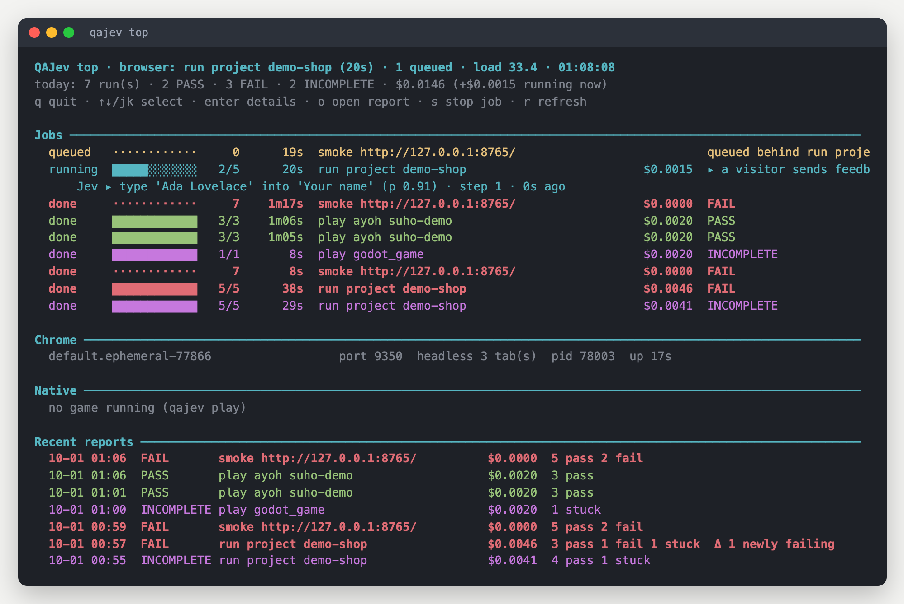

<a href="https://qajev.com">
  <picture>
    <source media="(prefers-color-scheme: dark)" srcset="docs/images/logo-dark.svg">
    
  </picture>
</a>

[](https://github.com/hanamorilabs/qajev/actions/workflows/tests.yml)
[](LICENSE)


**Test your website, game or app the way a person uses it.** Say what a visitor wants in plain words; **Jev**, a
small, fast model, clicks through a real Chrome to do it (or plays your game, or taps through your iOS or Android
app); QAJev judges the result from the page itself and gives you a clear report. From the command line, or from any
AI agent through MCP. **[qajev.com](https://qajev.com)**

```bash
qajev check https://shop.example \
  --goal "Find what the Pro plan costs per month. Stop when that price is visible." \
  --expect-text '$29 per month'
```


## Why QAJev

- **Plain-language tests.** No selectors to maintain. "Find the refund policy. Stop when the number of days is
  visible." still works after a redesign.
- **Verdicts you can trust.** Jev saying "done" is never proof: your expectations decide. And a problem with the
  product (**fail**) is never mixed up with a problem on the tool's side (**harness**) or a visitor getting lost
  (**stuck**, often a real usability issue).
- **Desktop and phone, always.** Every website test also runs in a phone view (a phone's screen size, touch and
  user agent, like a browser's device mode), unless you pin one device. [More](docs/writing-tests.md#desktop-and-phone).
- **Fast and cheap.** A decision takes about a quarter of a second and costs a fraction of a cent. The smoke crawl
  is free.
- **Safe by default.** Read-only on real sites, dangerous buttons hidden, Jev never types passwords or payment
  details, and QAJev types a password only for a seeded test account on your own machine (`localhost`, `*.test`);
  for any other account you sign in once in QAJev's window (`qajev browser login`) and it keeps that session. A hard
  cost cap on every run. [More](docs/safety.md).
- **Built for agents.** An MCP server, a ready-made [agent prompt](AGENT_PROMPT.md), jobs that any agent can follow
  or stop, and one shared queue so many agents can share a machine.
- **See it live.** `qajev top` in a terminal, or `qajev dashboard` in the browser: every run, what Jev is doing
  right now, what it costs, and each test with its screenshots.
- **Games too.** Godot and Electron games: Jev works the menus, the game's own bot plays in real time, QAJev
  watches the frame rate, memory and the game's state.
- **Mobile too.** Native apps and mobile websites on the iOS Simulator and Android emulator, on a throwaway
  device QAJev starts and removes itself. [More](docs/mobile.md).



## Quick start

```bash
uv tool install git+https://github.com/hanamorilabs/qajev     # or: pipx install git+https://github.com/hanamorilabs/qajev
mkdir -p ~/.qajev && echo 'OPENROUTER_API_KEY=sk-or-...' >> ~/.qajev/.env   # or TYPESAFE_API_KEY
qajev doctor                                                # checks your setup

qajev smoke http://localhost:3000                           # free: errors, broken links, missing basics
qajev check http://localhost:3000 --goal "Open the pricing page. Stop when the prices are visible." \
  --expect-url /pricing
```

Every run writes `report.html` (open it in a browser), `report.md` and `report.json`. Details:
[Getting started](docs/getting-started.md).

## What you can do

| | |
|---|---|
| **Crawl a site for free** | `qajev smoke URL`: HTTP errors, script errors, broken images and links, accessibility and SEO basics |
| **Check one thing** | `qajev check URL --goal ... --expect-text ...` |
| **Run a suite** | `qajev run suite.yaml`: several scenarios, on desktop, phone or tablet, with personas ([Writing tests](docs/writing-tests.md)) |
| **Prove a product works** | store its objectives once, run them any time, see what changed since last time ([Projects](docs/projects.md)) |
| **Every night** | `qajev nightly --install`: runs every project, tells you only when something changed |
| **From AI agents** | `qajev mcp` ([MCP](docs/mcp.md), [agents](docs/agents.md), [prompt](AGENT_PROMPT.md)) |
| **Watch and control runs** | `qajev top`, `qajev dashboard`, `qajev jobs`, `qajev stop` ([Jobs and top](docs/jobs-and-top.md), [The dashboard](docs/dashboard.md)) |
| **Test a game** | `qajev play path/to/game` ([Games](docs/games.md)) |
| **Test a mobile app** | `qajev play ios:com.example.app` or `android:com.example.app` ([Mobile](docs/mobile.md)) |

## Use it from an AI agent

```bash
claude mcp add -s user qajev -- qajev mcp       # Claude Code; see docs/mcp.md for Codex, Cursor and others
```

Or just tell your agent to read **[qajev.com/llms.txt](https://qajev.com/llms.txt)**: plain-text steps to check
whether QAJev is installed, install it, connect the MCP server and use it.

Then paste [AGENT_PROMPT.md](AGENT_PROMPT.md) into your agent's instructions. The agent can now crawl, check,
run your project's objectives, read reports and screenshots, and follow or stop runs:


## Documentation

[Getting started](docs/getting-started.md) · [Writing tests](docs/writing-tests.md) ·
[Reading a report](docs/reports.md) · [Projects](docs/projects.md) · [Jobs and top](docs/jobs-and-top.md) ·
[CLI reference](docs/cli.md) · [MCP](docs/mcp.md) · [Agents](docs/agents.md) · [Games](docs/games.md) ·
[Mobile](docs/mobile.md) · [Safety](docs/safety.md) · [Configuration](docs/configuration.md) · [How it works](docs/how-it-works.md) ·
[Troubleshooting](docs/troubleshooting.md)

## Requirements

- macOS or Linux, Python 3.12+, Google Chrome or Chromium.
- One key for Jev: [TypeSafe](https://docs.typesafe.ai) or [OpenRouter](https://openrouter.ai) (not needed for
  the smoke crawl).
- For games: [Godot](https://godotengine.org) 4, or the game's Electron app.

## Limits

Jev reads pages as text and works with standard controls. Shadow DOM, iframes, canvas-drawn interfaces, file
uploads, pop-up windows and custom keyboard widgets are out of its reach today, and it does not scroll far on its
own (start a scenario close to its target). Pages that never stop changing make its decisions go stale; those
come out as **harness**, never as a product failure.

On the iOS Simulator, QAJev tests native apps, but cannot yet read a web page inside Safari (its accessibility reader
sees only Safari's own controls), so `--real-devices ios` comes out **harness** with that reason. Android Chrome works.

**Tested on:** macOS and Linux (Debian, in Docker) with Chrome or Chromium, desktop and phone view; the iOS Simulator
(native apps); an Android emulator (native apps and Chrome); Godot 4 and Electron games; MCP from AI agents.

## Contributing

Issues and pull requests are welcome: see [CONTRIBUTING.md](CONTRIBUTING.md). Security problems:
[SECURITY.md](SECURITY.md).

## License

[MIT](LICENSE). Jev comes from [jev-ultrafast](https://github.com/browser-use/jev-ultrafast) (MIT), by TypeSafe
and Browser Use.
