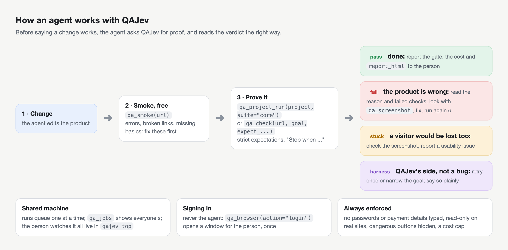

# Using QAJev from AI agents

QAJev was built for people **and** agents. An agent that changes a website can ask QAJev for proof that a visitor
can still do what matters, before saying the work is done.



## 1. Connect it

Either through MCP (recommended: see [MCP](mcp.md)), or by letting the agent run the CLI with `--json`, which
prints the report as JSON on stdout. Both give the same results.

## 2. Tell the agent how to use it

Paste [AGENT_PROMPT.md](../AGENT_PROMPT.md) into the agent's instructions: a `CLAUDE.md`, `AGENTS.md`,
`.cursorrules`, a system prompt, or the first message. It explains which tool to use when, how to write a goal
with strict expectations, how to read the outcomes (and that a `harness` outcome is not a product bug), and the
safety rules. Edit its last section to name your site and your project.

## 3. Give it a project

Agents do best with stored objectives: write `.qajev/project.toml` in your repository once
([Projects](projects.md)), and the agent's instruction becomes simply "run the core objectives after a change":

```
qa_project_run(project="shop", suite="core")
```

## A typical agent loop

1. The agent changes the product.
2. `qa_smoke` on the local site: free; it fixes whatever broke.
3. `qa_project_run` (or `qa_check` for something new) with strict expectations.
4. It reads the result:
   - **pass**: done; it reports the gate, the cost and `report_html`;
   - **fail**: it reads `reason` and the failed `checks`, calls `qa_screenshot` if it needs to see the page, fixes the
     product, runs again;
   - **stuck**: it looks at the screenshot; a visitor would likely be stuck too, so it reports a usability issue
     rather than guessing;
   - **harness**: not a product problem; it retries once or narrows the goal, and says so if it persists.
5. It hands the person the `report_html` path.

## Several agents on one machine

Runs queue one at a time machine-wide, whoever starts them, and every agent sees the same queue. So:

- an agent may start a run while another agent's run is going: its run waits, and says who it is waiting for;
- `qa_jobs` shows every run on the machine, and `qa_job(id)` shows what Jev is doing in any of them right now;
- any agent can stop any run with `qa_stop`. It should only stop its own, unless asked.

A person can watch all of it live with [`qajev top`](jobs-and-top.md).

## What agents are not allowed to do

QAJev enforces these, whatever the agent asks:

- no typing of passwords, one-time codes or payment details (the fields are disabled);
- no writes on real sites: form posts and deletes are blocked unless the site is on the same machine
  (`localhost`);
- no dangerous buttons: sign out, delete, pay, billing, "close all" and similar are hidden from Jev;
- no downloads;
- no spending past the cost cap.

Signing in is the person's job: `qa_browser(action="login")` opens a window for them, once, and the profile
remembers it. Or the suite or project names a stored test account (`account:` with a `keychain:`, `op://` or
`env:` password reference) and QAJev signs in by itself before the scenarios. An agent never handles the password:
it never asks for one, never puts one in a suite, and passes only the reference. See [Safety](safety.md).
