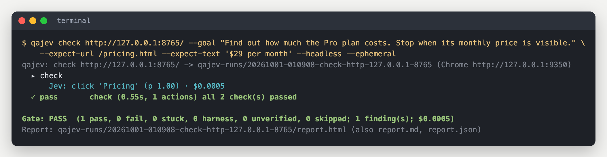

# Getting started

This takes about five minutes. You need a Mac or Linux machine, Google Chrome (or Chromium), and an API key for
Jev.

## 1. Install

With [uv](https://docs.astral.sh/uv/) (recommended):

```bash
uv tool install git+https://github.com/hanamorilabs/qajev
```

Or with [pipx](https://pipx.pypa.io/):

```bash
pipx install git+https://github.com/hanamorilabs/qajev
```

Either one puts a `qajev` command on your PATH. Python 3.12 or newer is needed; uv installs it for you if it is
missing.

QAJev looks for Chrome in the usual places (`/Applications/Google Chrome.app` on a Mac, `google-chrome` or
`chromium` on Linux). If yours lives elsewhere, set `QAJEV_CHROME` to its path. In Docker, or on a CI runner where Chrome
stops with "No usable sandbox!", set `QAJEV_CHROME_FLAGS=--no-sandbox`.

## 2. Add a key for Jev

Jev is the model that decides what to click. It is reached through one of two services; you only need **one**
key:

| Service | Key | Where to get it |
|---|---|---|
| TypeSafe (Jev's home) | `TYPESAFE_API_KEY` | [typesafe.ai](https://docs.typesafe.ai) |
| OpenRouter | `OPENROUTER_API_KEY` | [openrouter.ai/keys](https://openrouter.ai/keys) |

Put it in `~/.qajev/.env`:

```bash
mkdir -p ~/.qajev
echo 'OPENROUTER_API_KEY=sk-or-...' >> ~/.qajev/.env
```

An OpenRouter key runs everything, including the small helper model that writes what Jev types into text fields.
With a TypeSafe key, set `TEXT_MODEL_API_KEY` too if your tests fill in forms (any OpenAI-compatible key works;
see [Configuration](configuration.md)).

The free smoke crawl (`qajev smoke`) needs no key at all.

## 3. Check your setup

```bash
qajev doctor
```

It checks your keys (it never prints them), Chrome, a free port and the machine's load, and tells you what to fix.

## 4. Your first test

A **smoke crawl** is free: it visits the pages of a site and lists errors, broken links and missing basics.

```bash
qajev smoke http://localhost:3000 --max-pages 20
```

A **check** gives Jev one goal and judges the result:

```bash
qajev check http://localhost:3000 \
  --goal "Find the pricing page. Stop when the plan prices are visible." \
  --expect-url /pricing --expect-text '$29'
```

While it runs you see what Jev does, step by step, and what it costs:



Open the `report.html` it names in your browser. [Reading a report](reports.md) explains everything on it.

## 5. Try it on the demo site (optional)

The repository ships a small demo site with a pricing page, a feedback form, a broken page and a page you cannot
scroll. It runs on your own machine only.

```bash
git clone https://github.com/hanamorilabs/qajev && cd qajev
python3 tests/fixtures/serve.py &                 # http://127.0.0.1:8765
qajev run examples/fixture.yaml --ephemeral --headless
```

## Next

- [Writing tests](writing-tests.md): goals, expectations, suites of scenarios.
- [Projects](projects.md): store a product's objectives once, run them any time, see what changed since last time.
- [Use it from an AI agent](agents.md): the MCP server and a ready-made prompt.
- [CLI reference](cli.md): every command and option.
