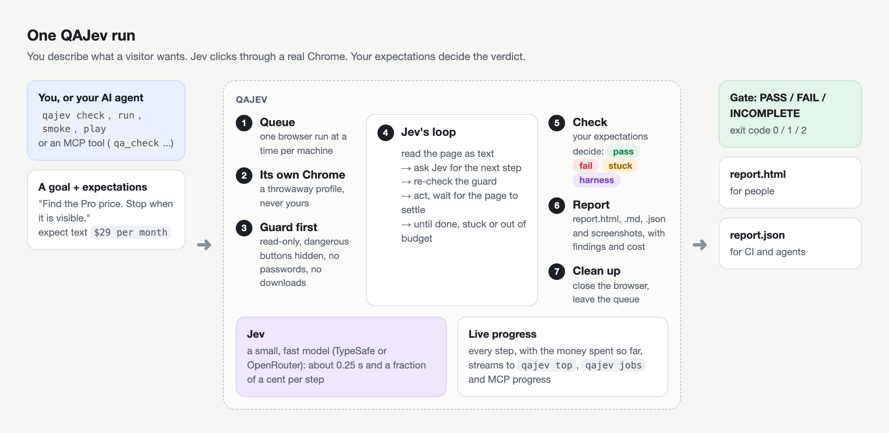

# How it works

## The idea

Most end-to-end tests are scripts: click this selector, type there, expect that. They break when the page
changes, and they only test the path someone wrote down.

QAJev tests the way a person does. You write **what a visitor wants** and **how you will know it worked**. Jev, a
small, fast model built for choosing the next step on a page, reads the page as text and picks what to click,
one step at a time, like a first-time visitor would. QAJev decides the verdict from the page and its side
effects, never from Jev's opinion.

That split matters: if Jev gets lost, that is either a usability problem worth seeing (**stuck**) or a problem on
QAJev's side (**harness**), and neither is confused with the product being wrong (**fail**).

## One run, step by step

1. **Queue.** Only one browser run happens at a time on a machine. A run waits its turn and says for whom.
2. **Clean up.** Anything left behind by runs that died (browsers, helper processes, temporary profiles) is
   removed.
3. **Browser.** QAJev starts its own Chrome (a throwaway profile, or a named one you signed in to). With a stored
   test account, QAJev signs in first, by itself, in a tab of its own: the password is read from its store
   only then, typed only into a password field, and Jev never sees it. A failed sign-in ends the run there.
4. **Guard first.** A new tab opens on a blank page and the safety guard is installed for every page before the
   site loads (see [Safety](safety.md)).
5. **Each scenario.**
   - Go to the start page; run any `before` steps.
   - **Jev's loop:** read the page (text, controls, errors, blank screens); stop as soon as the expectations
     already hold; otherwise ask Jev for the next action (one quick model call, checked against the cost cap),
     prove the guard is still there, act, and wait for the page to settle. It stops when Jev says it is done or
     stuck (QAJev scrolls and looks again twice first), or when a budget runs out.
   - **Check:** wait a few seconds for the expectations; run request and command checks; take a screenshot.
   - **Verdict:** the checks decide the outcome.
6. **Report.** `report.html`, `report.md` and `report.json`, written as the run goes so a crash or a stop keeps
   what finished. Secrets are removed first.
7. **Clean up.** Close the tab and the browser, delete a throwaway profile, leave the queue.

The smoke crawl follows the same path without Jev: it visits pages one by one and judges each from its status,
errors and a lint of the page.

## Where each part lives

| Part | File |
|---|---|
| commands and options | `qajev/cli.py` |
| a suite run and Jev's loop | `qajev/runner.py` |
| one browser tab: Jev, the guard, page reads | `qajev/session.py` |
| stored test accounts: signing in, password stores | `qajev/signin.py`, `qajev/vault.py` |
| the guard | `qajev/guard.py`, `qajev/js/guard.js` |
| checks, outcomes, findings | `qajev/verdict.py` |
| the smoke crawl | `qajev/smoke.py`, `qajev/js/page_facts.js` |
| reports | `qajev/report.py`, `qajev/report_html.py` |
| projects, the index, changes, nightly | `qajev/project.py`, `qajev/changes.py`, `qajev/nightly.py` |
| jobs and the queue | `qajev/jobs.py` |
| `qajev top` | `qajev/top.py` |
| games | `qajev/native.py`, `qajev/electron.py`, `qajev/bridges/` |
| QAJev's own Chrome | `qajev/chrome.py` |
| model routing and the cost ledger | `qajev/providers.py`, `qajev/ledger.py` |
| the MCP server | `qajev/mcp_server.py` |

## Progress events

With `--events`, a run prints one JSON object per line on stderr as it goes. Jobs keep them, MCP relays them as
progress, and `qajev top` reads them.

| `event` | When | Fields |
|---|---|---|
| `waiting` | queued, or waiting for the machine to calm down | `reason`, `queued` |
| `reaped` | leftovers of dead runs were cleaned up | `items` |
| `run` | the browser is ready | `suite`, `run_dir`, `browser`, `scenarios` |
| `signin` | a stored test account starts signing in, then has signed in or failed | `account`; then `ok`, `email`, `seconds` or `reason` |
| `start` | a scenario begins | `scenario` |
| `step` | each move Jev makes; every 2 s of real-time game play | `scenario`, `doing`, `p`, `n`, `spent_usd`, `at` |
| `scenario` | a scenario finished | `result` |
| `done` | the report is written | `gate`, `run_dir` |

## Jev

Jev comes from [jev-ultrafast](https://github.com/browser-use/jev-ultrafast) (TypeSafe × Browser Use). It
accepts text only, which is why QAJev describes every page, and every game screen, as text plus labelled
actions. A decision takes about a quarter of a second and costs a fraction of a cent.
