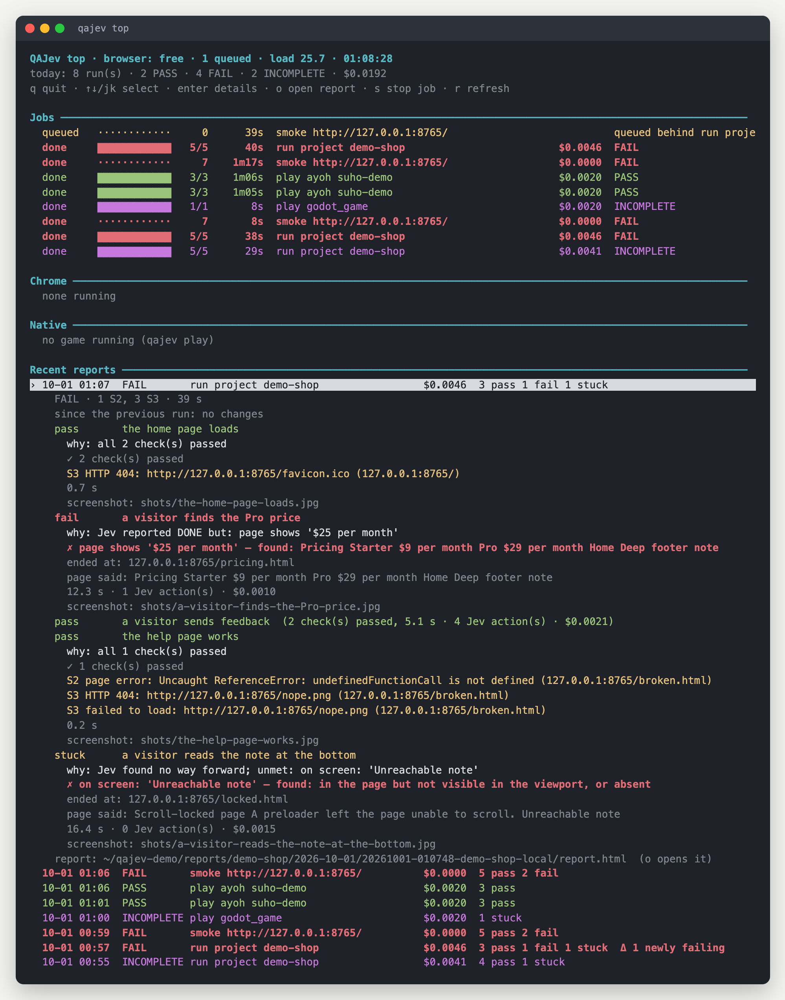

# Jobs, the queue and `qajev top`

## One run at a time

QAJev runs **one browser test at a time on a machine**, whoever starts it: you in a terminal, a teammate, or any
number of AI agents through MCP. Everyone else waits in a queue, and a queued run says who it is waiting for:

```
  waiting: queued behind run project shop (pid 4123, since 18:22)
```

This keeps a shared machine usable and stops two tests from fighting over the same browser. Before each
scenario (for `smoke` and `play`, before starting) QAJev also waits while the machine is very busy (see `--load-high` in the [CLI reference](cli.md)).

## Jobs

Every run is a **job**, including runs started in the foreground, so any run can be followed or stopped from
anywhere.

```bash
qajev run --project shop --background   # start as a job and return at once; prints its id
qajev jobs                              # who has the browser; queued, running and recent jobs
qajev jobs 20261001-101502-a3f9         # one job: progress, scenarios finished so far, its report
qajev stop 20261001-101502-a3f9         # stop it
```

Every job's title says what it is about, so a list of runs from several agents stays readable:

| Run | Title |
|---|---|
| a website check | `check foley /pricing · Find what the Pro plan costs per month`: the QAJev project the URL belongs to (else its host), the page, and the goal without its "Stop when ..." |
| a crawl | `smoke foley` |
| a project | `run project shop · core` |
| a game | `play imhim · quit sends session_end`: the bundled adapter or the game's folder (never `desktop`, `game`, `godot` or a worktree), then `--name` or the suite's `name:` |
| a mobile app | `play android:com.example.app · onboarding` |

Stopping a job is clean: it closes its browser, keeps the scenarios that already finished, and still writes its
report (marked INCOMPLETE). Finished jobs are forgotten after 7 days; their reports stay.

## `qajev top`: the live dashboard

```bash
qajev top           # live, refreshed every second
qajev top --once    # print one snapshot and exit
qajev top --json    # the same, as data
```


From the top:

- **The header**: who has the browser and for how long, how many runs are queued, the machine's load, and today's
  runs and spend (plus what running jobs have spent so far).
- **Jobs**: each run with its state, a progress bar, scenarios done out of the total, time, cost so far and the
  scenario in flight. Under a running job, a line shows what the decision model is doing right now, named for the
  model deciding (**`Jev ▸`**, or **`Clef-flash ▸`** / **`Clef ▸`** when the run uses Clef), for example
  `click 'See pricing' (p 0.93) · step 4 · 1s ago`, or during a game `playing 42s: kills 120 · level 3 · 60 fps`.
- **Chrome**: the browsers QAJev has open (and whether they are headless).
- **Native**: games QAJev is running.

  A browser or game that is up shows in green with a `●`; "none running" and "no game running" stay grey, and a
  browser that has gone away shows in red.
- **Recent reports**: the latest runs of all projects, with the gate, cost, outcomes and a `Δ` when something
  changed since the previous run.

### Keys

| Key | Does |
|---|---|
| `↑` `↓` or `j` `k` | select a job or report |
| `enter` | open or close its details |
| `o` | open the selected run's report.html in your browser |
| `s` | stop the selected job (asks y/n first) |
| `r` | refresh now |
| `q` | quit |

**Details** explain each scenario: why it ended as it did, each failed check with what was found instead, the
findings (repeats grouped), where Jev ended up, what the page said, time, cost and the screenshot.


