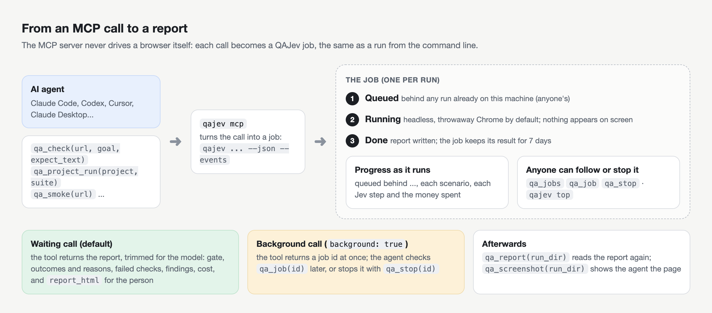

# QAJev as an MCP server

[MCP](https://modelcontextprotocol.io) lets AI agents (Claude Code, Codex, Cursor and others) call tools. QAJev's
MCP server gives an agent the same powers as the CLI: crawl a site, run checks and suites, prove a project's
objectives, read reports and screenshots, and follow or stop runs.



## Add it to your agent

The server is the `qajev mcp` command. Install QAJev first ([Getting started](getting-started.md)).

**Claude Code**

```bash
claude mcp add -s user qajev -- qajev mcp
```

**Codex** (`~/.codex/config.toml`)

```toml
[mcp_servers.qajev]
command = "qajev"
args = ["mcp"]
```

**Cursor, Claude Desktop and other clients** (their MCP JSON settings)

```json
{
  "mcpServers": {
    "qajev": { "command": "qajev", "args": ["mcp"] }
  }
}
```

If the client cannot find `qajev`, use its full path (`which qajev`). The server reads the same keys as the CLI
(`~/.qajev/.env`). To pin the Jev route for MCP runs, add an environment variable in the client's settings, e.g.
`QAJEV_JEV_PROVIDER=openrouter` (or `cloudflare` for Clef).

After upgrading QAJev, restart the agent's session (or reconnect the server, `/mcp` in Claude Code) to pick up new
tools.

Then give your agent the [agent prompt](../AGENT_PROMPT.md), so it knows when and how to use the tools.

## The tools

| Tool | Does | Costs |
|---|---|---|
| `qa_smoke` | crawl a site and list errors, broken links, accessibility and SEO gaps | free |
| `qa_check` | one scenario: a goal and expectations on a URL | Jev decisions |
| `qa_run_suite` | a suite, from a file or inline YAML | Jev decisions |
| `qa_project_run` | a project's stored objectives, or one ad-hoc objective | Jev decisions |
| `qa_play` | test a game (Godot or Electron) or a mobile app: menus with Jev, real-time play with the game's pilot | Jev decisions |
| `qa_projects` | the projects QAJev knows | free |
| `qa_reports` | recent project runs | free |
| `qa_report` | read a run's report (JSON or Markdown) | free |
| `qa_screenshot` | see a run's screenshots as images (default: the first scenario that did not pass) | free |
| `qa_jobs` | every run on the machine: queued, running, recent (anyone's) | free |
| `qa_job` | one run: progress, what Jev is doing now, scenarios finished so far, the report once done | free |
| `qa_stop` | stop a run (it cleans up and keeps what finished) | free |
| `qa_rerun` | run a finished job again: by default only its failed, stuck and harness tests | as the run |
| `qa_nightly` | the latest nightly digest: what changed per project | free |
| `qa_browser` | QAJev's own Chrome: status, start, stop, **login** (the person signs in), reap | free |
| `qa_doctor` | check the setup (never shows key values) | free |

### Main parameters

- `qa_check`: `url` (required), `goal`, `expect_text`, `absent_text`, `expect_url`, `expect_js`, `fetch`, `mode`
  (`readonly` or `mutate`), `device`, `persona`, `about`, `max_actions`, `max_seconds`, `cost_cap`, `profile`, `headless`,
  `background`, and with Clef `expect_looks` (statements judged from the final screenshot) and `vision` (Clef sees
  the screen with every decision).
- `qa_run_suite`: `suite_path` or `suite_yaml`, `only`, `jobs`, `cost_cap`, `profile`, `background`.
- `qa_smoke`: `url` (required), `max_pages`, `device`, `check_links`, `ux` (default true: measured UX notes and design consistency, free).
- `qa_project_run`: `project` (required), `suite` (a tag), `names`, `env`, or an ad-hoc `objective` with `url`,
  `expect_text`, `expect_url`, `about`.
- `qa_rerun`: `job` (required), `failed` (default true: only the tests that did not pass), `background`.
- `qa_play`: `project` (the game, or `ios:...` / `android:...`), `goal`, `adapter`, `suite`, `only` (steps of the
  suite, with their `depends_on` and `setup: true` steps), `game_env`,
  `game_args`, `expect_screen`, `expect_text`, `expect_state`, `min_fps`, `name`, `about`, `headless` (Godot only), `shots`
  (a screenshot at the end of each step, on by default), and with Clef `expect_looks` and `vision` (these open the
  game's window: they need it to look). `vision` is on by default when Clef decides and the game has a window
  (Electron, mobile, `headless=false` Godot); `vision=false` turns it off. Quit and
  delete-save buttons are hidden from Jev; to test a normal quit pass `allow: ["QUIT"]` and `expect_closed: true`
  (passes only when the game exits by itself with code 0). `hide` hides more labels.
- Website tools also take `devices` (default desktop and phone: every website test also runs in a phone view).
  `qa_check`, `qa_run_suite` and `qa_project_run` take `real_devices` (`["ios"]`, `["android"]` or both) to
  also run in Chrome on an Android emulator (iOS Safari cannot read page content yet): opt-in, read-only, and slower
  (see [Mobile](mobile.md)).
- All run tools take `verbose` (include Jev's steps) and `background` (return a job id at once).
- `about`: what the test proves and why, in plain words. The server's instructions ask agents to give it on every
  test (and `about:` on each scenario or step of a suite); a result lists the tests without one, or with a check
  without words, under `about_missing`. The report and `qajev dashboard` show it under each test's name.
- `says` (`qa_check`): what `expect_js` proves, in plain words, for the test plan. Without it the check is NOT
  DESCRIBED and the gate INCOMPLETE ([Reports](reports.md#the-test-plan)).

## How a call runs

- By default a run tool **waits** for the report and sends progress while it runs: queued, each scenario starting
  and finishing, and each move Jev makes with the money spent so far. Cancelling the call stops the run.
- With `background: true` it returns a **job id** at once. Follow it with `qa_job(job)`; stop it with
  `qa_stop(job)`.
- Runs from MCP use a **headless, throwaway Chrome** by default: nothing appears on the person's screen and
  nothing is left behind. Pass `profile` for a signed-in run (the person signs in once with
  `qa_browser(action="login", profile=..., url=...)`). On a local dev host only, the suite or project can name a
  seeded test account (`account:` with `password: seed:FILE#KEY`; `keychain:`, `op://` and `env:` are refused):
  QAJev then signs in by itself before the scenarios, also headless, and the password never reaches the agent or Jev
  ([Writing tests](writing-tests.md#signed-in-areas)).
- Runs queue one at a time per machine, shared with the CLI and every other agent. `qa_jobs` shows the queue.
  Each job's title says what it is about: the project or site and the goal for website runs (`check foley /pricing
  · Find the Pro price`), the game and the test's name for games (`play imhim · quit sends session_end`).

## What an agent gets back

The result is trimmed to fit a model's context; the full report stays on disk.

| Field | Is |
|---|---|
| `gate`, `exit_code`, `counts` | PASS / FAIL / INCOMPLETE, and how many scenarios had each outcome |
| `findings` | problems seen along the way (S1 to S3), with where; `known_findings` for a project's known ones |
| `needs_sign_in` | only when runs met a sign-in page: `pages`, and a `next_step` to follow (ask the person to sign in once with qa_browser login; never ask for the password) |
| `scenarios[]` | per scenario: `outcome`, `reason`, `checks` (each with `ok` and what was found), `findings`, `end_url`, `page_says` (what the page said), `jev` (actions, decisions), `shot` (screenshot path), `seconds`, `cost_usd` |
| `cost` | money spent, Jev decisions, text calls, the cap |
| `run_dir`, `report_html`, `report_md`, `job` | where the full report is (give `report_html` to the person), and the job id |

`verbose: true` adds each scenario's steps and Jev's view of every screen. `qa_report(run_dir)` reads a report
again later; `qa_screenshot(run_dir)` returns the screenshots as images when the agent needs to see the page.

## Shell hooks

Suites can contain shell commands (checks or hooks). MCP clients cannot run those unless the server was started
with `qajev mcp --allow-commands`. Only enable it if you trust every suite the agent may run.
