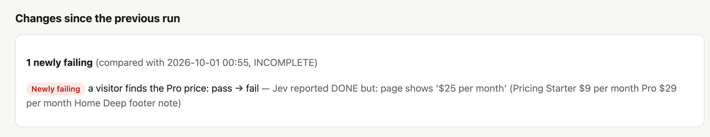

# Projects: prove a product works, again and again

A **project** stores what a product must always do: its **objectives**. Write them once; then anyone (you, a
teammate, an AI agent, a nightly schedule) can ask QAJev for proof that they still hold, and see what changed since
the last time.

## Where a project lives

Either inside the product's own repository (recommended; commit it):

```
my-shop/
  .qajev/
    project.toml
    .gitignore        # keeps the reports out of git (QAJev writes it)
    reports/          # every run, by date
```

or as `~/.qajev/projects/<name>.toml` with `repo = "/path/to/my-shop"`, while the repository has not adopted one.
Set `QAJEV_PROJECTS` to add more folders to look in.

Refer to a project by its `name`, or by a path (the repository, its `.qajev` folder or the `.toml` file). Inside
the repository, its name is enough.

## A project file

```toml
name = "shop"
default_env = "prod"

[env.prod]                       # production is always read-only
base_url = "https://shop.example"
hosts = ["cdn.shop.example"]     # other hosts Jev may visit
smoke_start = "/products"        # where `qajev smoke --project` starts (default /)

[env.local]                      # changes are allowed on your own machine only
base_url = "http://localhost:3000"
mode = "mutate"

[accounts.tester]                # references only, never passwords
email = "qa+shop@example.com"
password = "keychain:qajev/shop-tester"   # or "op://QA/Shop tester/password", or "env:SHOP_TESTER_PASS"
login = { url = "/login" }       # QAJev signs in with it before the objectives (see Writing tests)
seed = "scripts/seed-test-user.sh"
profile = "shop-local"           # or: a QAJev browser profile you signed in to once

[accounts.qa-test]               # a seeded TEST user on a local dev host: second factor included
email = "seed:dev_support/qa_test_user.json#email"            # FILE#KEY, relative to the project's repo
password = "seed:dev_support/qa_test_user.json#password"
totp = "seed:dev_support/qa_test_user.json#totp_secret_base32"  # or: cookie = { name = "...", value = "seed:...#session" }
login = { url = "/login" }       # localhost, 127.0.0.1, *.test only (Writing tests: "A seeded test user")

[budget]
cost_cap_usd = 0.50
actions = 20
seconds = 120

[[known]]                        # a problem you already know about: listed as "known", not raised again
kind = "HTTP 404"
url = "https://shop.example/"
note = "No index page by design; redirect pending"

[[objective]]
name = "a new visitor finds the UK price"
about = "UK visitors see the price in pounds before they sign up"   # what it proves, shown with its result
url = "/pricing"
goal = "You are in the UK. Find what the Pro plan costs per month. Stop when that price is visible."
expect = { visible = ["£11.50"] }
tags = ["core"]

[[objective]]
name = "a visitor sends feedback"
url = "/feedback"
goal = """Send feedback as Ada Lovelace, email ada@example.test, with the message "Lovely site." \
Stop when a thank-you message is visible."""
expect = { text = ["Thanks, Ada Lovelace"], fetch = [{ url = "/api/feedback", status = 200 }] }
tags = ["core"]
```

Objectives use the same goals, expectations and `about` as any scenario (see [Writing tests](writing-tests.md)).

To run an environment's objectives signed in, name the account: `account = "tester"` under `[env.prod]` (or at
the top of the file, for every environment). QAJev signs in with it once before the objectives; the password is
read from its reference at that moment and never written anywhere. Since 0.4.0 that is only a seeded test account on
a local dev host (`password = "seed:FILE#KEY"`); `keychain:`, `op://`, `env:` and the older `password_env` are
refused. For a real site, sign in once with `qajev browser login --profile NAME --url LOGIN_URL` and run with that
profile ([Signed-in areas](writing-tests.md#signed-in-areas)).

## Running it

```bash
qajev projects                                        # what QAJev knows, and where reports go
qajev run --project shop --suite core                 # the objectives tagged "core", in the default environment
qajev run --project shop --env local                  # every objective, against your machine
qajev run --project shop --name "a visitor sends feedback"
qajev run --project shop --objective "A visitor finds the refund policy" --expect-text "30 days" \
  --about "the refund window is easy to find"   # ad hoc
qajev smoke --project shop                            # a free crawl of the project's site
qajev reports --project shop                          # recent runs: gate, outcome per objective, cost, path
```

An ad-hoc `--objective` without expectations comes out **unverified**: Jev's own "done" is never proof.

## What gets written

Each run goes into `.qajev/reports/<date>/<time>-<name>/` (or `reports/<project>/` for a central project):

- `report.html`: the report to open in a browser ([Reading a report](reports.md));
- `report.md` and `report.json`: the same, as text and as data;
- `findings.json`: every finding, marked as a **product** problem or a **harness** problem (QAJev's side), with
  its evidence;
- `shots/`: a screenshot at the end of each objective.

A cross-project **index** keeps one line per run (gate, outcome per objective, cost, where the report is), so
`qajev reports` and `qajev top` can list recent runs across all projects.

## What changed since last time

Every project run compares itself with the previous finished run of the same project, environment and kind:

- **newly failing**: it passed before, it does not now;
- **fixed**: it failed before, it passes now;
- **new** and **gone** findings.

The comparison appears at the top of the report ("Changes since the previous run"), in `qajev reports`, and in
`qajev top` (a `Δ` on the run's line).



## Nightly runs

`qajev nightly` runs each project's `core` objectives and a small smoke crawl, one project at a time, compares them
with the previous night, and writes a digest. It notifies you **only when something changed**.

```bash
qajev nightly --plan                  # what would run
qajev nightly                         # run it now
qajev nightly --last                  # the latest digest
qajev nightly --install --at 03:30    # every night (macOS launchd; on Linux it prints a cron line to use)
qajev nightly --uninstall
```

Digests are written to `~/.qajev/nightly/`. Set `QAJEV_NOTIFY_CMD` to a command that posts the digest somewhere
(it receives `$QAJEV_DIGEST`, the file, and `$QAJEV_DIGEST_TEXT`, a one-line summary). Agents read the latest
digest with the `qa_nightly` tool.
