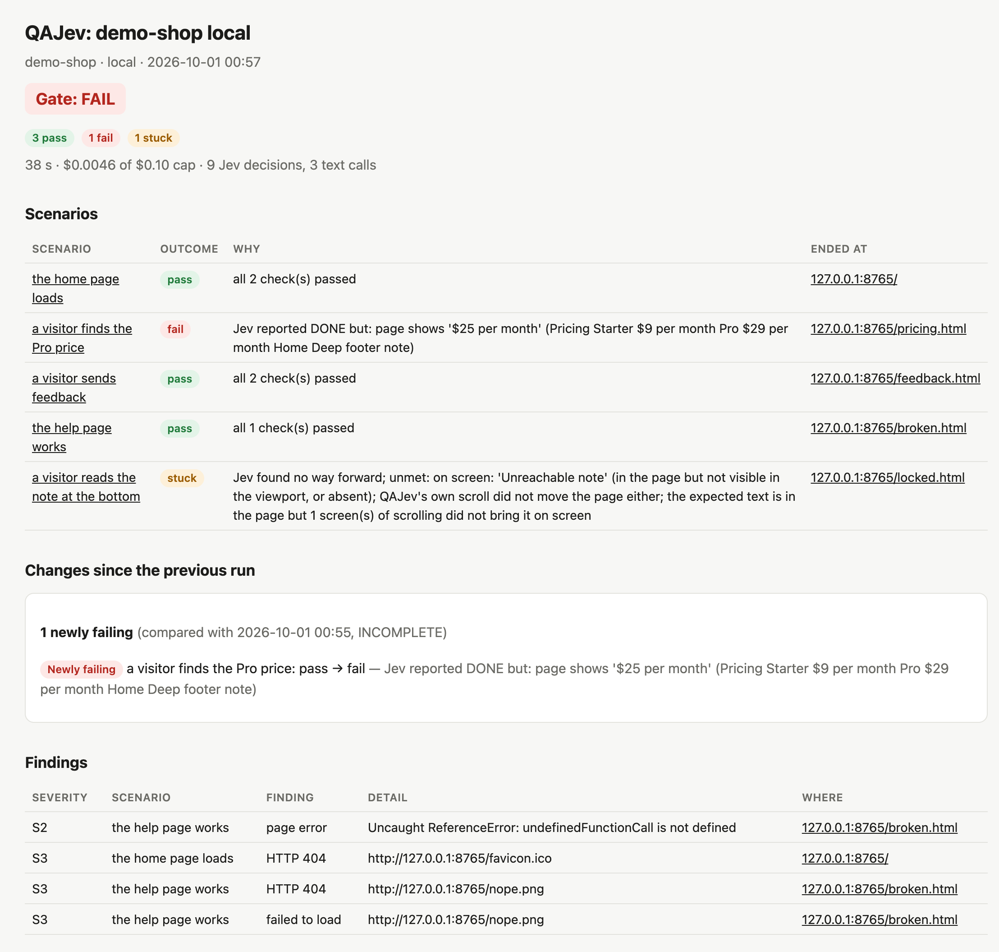
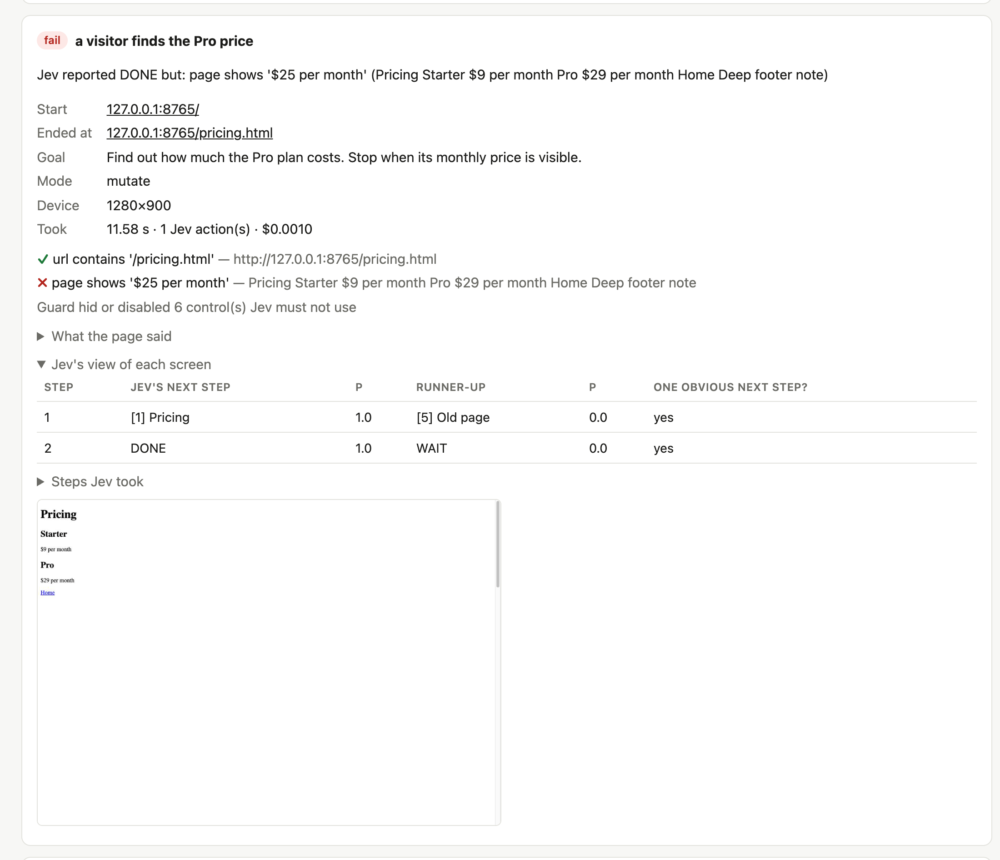
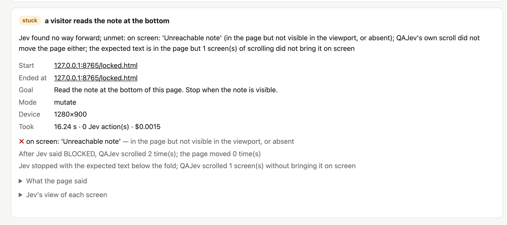
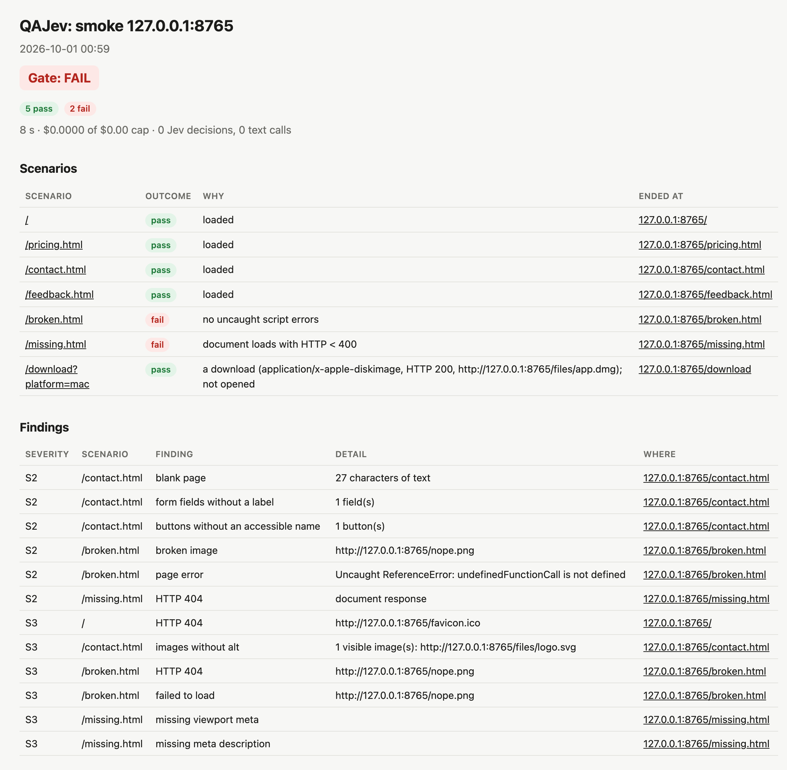
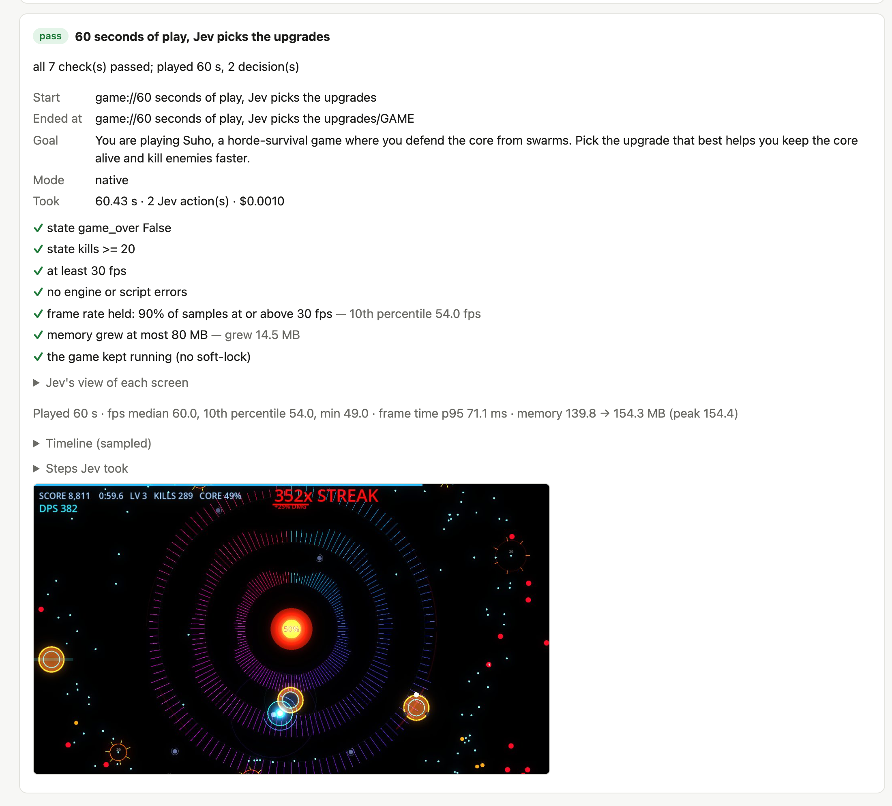

# Reading a report

Every run writes a folder with:

| File | For |
|---|---|
| `report.html` | people: one page, opens in any browser, works offline, light and dark themes |
| `report.md` | people and chat: the same content as text |
| `report.json` | programs and AI agents |
| `shots/*.jpg` | the screen at the end of each scenario |

Each report names the QAJev version and the commit that judged it (`qajev_commit` in `report.json`; `+dirty` when
QAJev's own code had uncommitted changes, absent for an installed package), so an old verdict can be traced to the
rules it was judged by.

The CLI prints the folder when the run ends. `qajev report <folder>` prints the Markdown again, and
`qajev report <folder> --html` rebuilds the page from `report.json`.

## The test plan

The page opens with the plan: one numbered item per test, with its `about` and each of its checks in plain words,
and a box: ✓ green passed, ✗ red failed, ! amber stuck or harness, empty not run. "What it proved" under a passed
test is its `about` and the checks it ticked. A test or check its author did not describe says **NOT DESCRIBED**
(the raw check stays under "For agents"), and makes the gate INCOMPLETE rather than PASS. `report.json` has the plan
(`plan`) and the tests it flags (`not_described`); [Writing tests](writing-tests.md) says how to give the words.

## The gate

At the top: the verdict for the whole run.

| Gate | Means | Exit code |
|---|---|---|
| **PASS** | every scenario passed | `0` |
| **FAIL** | at least one scenario failed: the product is wrong somewhere | `1` |
| **INCOMPLETE** | nothing failed, but something could not be judged (stuck, harness, skipped...), or a test is NOT DESCRIBED | `2` |

The exit codes make QAJev easy to use in CI. Other exit codes: `3` a mistake in the suite or options, `4` no
browser available, `5` refused (the run would have changed a production site; nothing was started), `130` stopped.

Each scenario lists what the guard did on the page: writes it blocked, every write it let through because
`guard.allow_requests` named it ("Allowed write: POST ..."), and each `confirm`, `prompt` or `beforeunload` it
dismissed. A run with `allow_destructive` opens with a red banner saying destructive controls were shown.

## Outcomes

Each scenario ends with one outcome. The most important idea in QAJev: **a failure of the product and a failure of
the test tool are kept apart.**

| Outcome | Means | What to do |
|---|---|---|
| **pass** | every expectation held, and every one of them ran | nothing |
| **fail** | the product is wrong: a check failed, or the page did not load | read the reason and the failed checks |
| **stuck** | Jev looked for a way forward and found none (QAJev also scrolls and looks again, twice) | look at the screenshot: often a real usability problem |
| **harness** | QAJev's side: time or action budget used up, cost cap reached, a page that never stops changing, a model error, a browser error, a failed hook, or Jev saying DONE without taking a single action while a check fails | says nothing about the product; retry or narrow the goal |
| **unverified** | the scenario had no expectations | add some |
| **skipped** | a scenario it depends on did not pass, or the machine was too busy | fix that first |

`--strict` counts **stuck** as a failure.

A run that would have changed a production site never gets as far as an outcome: it is **refused** before Chrome
starts (exit code 5, `{"outcome": "refused", "reason": ...}` with `--json`), and nothing is reported because nothing
ran ([Safety](safety.md)).

A run that broke before it finished (a browser error, a failed hook, a guard that went missing) is never a
**pass**, even when every check that ran passed, and neither is a run that stopped before some of its checks or steps
ran. It is **harness**, and the reason says where it stopped and what never ran: "browser/daemon error: step 4
(snapshot walking): RuntimeError: ...; 2 check(s) ran and passed; not run: step 5 (js), the final checks".
`report.json` has the same as `stop_detail` and `not_run`. An action or time budget is different: Jev wandered,
but the page was still judged in full, so its checks decide.

A run with a seeded test account says who signed in, under **Run** ("Sign-in: as seeded test user
qa+shop@example.test on localhost (account shop-tester), in 3.1 s; TOTP from seed: yes"). When the sign-in fails,
that line gives the site's reason and every scenario is **harness**: nothing was tested.

**Run** also says where each of QAJev's keys came from ("Keys": the file or the shell, names only, never values),
how long someone watched the run live in the dashboard ("Watched live", `watched_live_s` in `report.json`), and, for
an Electron game run with `--game-profile`, which save folder was used and that it was kept ("Game profile").

A scenario that ended on a sign-in page it did not start on is **harness** too ("needs sign-in: ..."), and the
report says at the top which pages asked to sign in and how to set up access
([Signed-in areas](writing-tests.md#signed-in-areas)).

## Why a scenario ended as it did

Each scenario explains itself: the reason, each check with what was found instead, where Jev ended up, and what the
page said.

A **stuck** scenario says what QAJev tried (here: the page cannot scroll, so the note at the bottom is out of reach,
which a visitor would hit too):

## The smoke crawl's report

A smoke crawl lists every page it visited, its outcome, and the findings per page:

## UX

A smoke crawl also measures how easy each page is to use, and adds a **UX** section to the report. It costs nothing
(no model calls) and never changes the gate: a UX note is advice, not a failure. Each note says what it rests on
(**measured** here) and the rule it was measured against, with examples:

| Note | Measured how | Rule |
|---|---|---|
| low text contrast | each text's colour against the background it really sits on | WCAG 2.2 1.4.3: 4.5:1, or 3:1 for text from 24px (18.66px bold) |
| contrast not measured | text over an image or a gradient, or faded: counted, never guessed | check those by eye |
| text cut off | a box hides part of the text in it: its own box (overflow hidden, no ellipsis or line clamp), or part of the text by a box it sits in. Text wholly out of view (a carousel's other slides) or on a moving track (a ticker) is not counted; text hidden for screen readers only (a clipped 1x1 box) is no visible text and is skipped | |
| text overflows its box | text drawn outside the box a person sees it in (the nearest with a border, a background or a shadow, such as a card or a button), with nothing clipping it, by 4 px and half its font size or more: it runs into what is next to it | |
| text overlapping | the words of two texts, neither inside the other, drawn over each other by 4 px or more, line by line as shown (a wrapped inline is its lines, not one box; lines scrolled or clipped out of view do not count), and on screen nothing opaque lies between them (text under a full-screen splash is not seen overlapping) | |
| not reachable by keyboard | QAJev presses Tab through the page; these controls never got focus | WCAG 2.2 2.1.1 |
| keyboard not measurable | a game (a canvas filling half the screen or more) cancelled every Tab and focus never moved: it uses Tab as one of its keys, so reach, visible focus and traps are not measured; check its own keys by hand | |
| keyboard blocked | an ordinary page cancelled every Tab and focus never moved: a keyboard user cannot reach its controls | WCAG 2.2 2.1.1 |
| no visible focus | a control looks the same with and without keyboard focus | WCAG 2.2 2.4.7 |
| keyboard trap | focus stays on one control for 3 Tab presses | WCAG 2.2 2.1.2 |
| sideways scroll / text cut off at 200% zoom | the page laid out at half the width and twice the scale, as at 200% zoom | WCAG 2.2 1.4.10 and 1.4.4 |
| dialog | an open dialog without a name, not marked modal, not holding focus, or not closing on Escape | WAI-ARIA dialog pattern |
| *kind* style differs | **design consistency**: the computed style of each kind of element (h1, h2, h3, body text, inline links, buttons, text fields) compared across pages, per device; each page that differs from the style most pages use is named with both values (`about: font-size 28px (vs 32px)`) | |

The keyboard walk and the zoom pass run on a desktop layout (a phone has no Tab key). `--no-ux` (or `ux: false` in
`qa_smoke`) skips all of it. The [dashboard](dashboard.md) shows the same notes under each test, and
[`qajev top`](jobs-and-top.md) counts them.

Known limit: a game is told apart from a page by its canvas size only. An ordinary page with a decorative full-screen
canvas that cancels Tab reads "keyboard not measurable", not "keyboard blocked"; check such a page's keyboard by hand.
And the overlap test compares text with text: a box that covers text (a floating button over a paragraph) is not
reported.

A scenario with a goal adds **struggle signals**: what Jev's own run says about how findable the goal was. They cost
nothing on top of the goal run they are read from (that run itself calls Jev, so it is paid), and they are evidence,
not a verdict: a person may find a page Jev hesitated on, and the reverse.

Before blaming the page, QAJev asks whether the reason was its own. A goal not reached because the read-only guard hid
a control the goal needs (an off-site link without `--host`: "blocked by the guard: it hid 'Open on the web'
(off-site link: my.foleyapp.com), which the goal needs; add --host my.foleyapp.com"), or because the goal needs a key
press or a drag (Jev clicks, types, chooses and scrolls; a key is a `key` hook's job), is **harness** with that reason,
and gets no struggle signals: it says nothing about the page.

Both tests are strict, so that a real struggle stays the page's:
- A key counts only as a key press: "press Escape", "hold Space to charge", "press Tab twice", "the backquote key",
  "the W key". A backtick around code (`` Run `tab claude` ``), a product's key ("copy the new key") or a tab ("the
  tab's Close button", "the tab cap", "tap the tab to open it") is not a key press.
- A danger or read-only control counts only when the goal asks for its action: the guard's words as one phrase in the
  goal, in order, and the control's object when it names one. "Delete the test account" needs a hidden "Delete
  account"; "Find your account settings" does not, and "sign in" never asks for "Sign out". An off-site link counts
  when the goal shares a word with its label or its host.

| Note | From |
|---|---|
| findability | always: reached or not (or "Jev finished, but the checks failed"), in how many actions over how many pages, with backtracks, scrolls and unsure steps, and QAJev's own recovery scrolls apart |
| unclear choice | a step where Jev's top choice was under 0.8 and the runner-up within 0.25: two options looked almost equally right (`'Plans' (0.48) vs 'Pricing' (0.41)`) |
| backtracked | Jev went back to a page it had already left |
| searched by scrolling | 4 or more scrolls: what Jev needed was not near the top |
| below the fold | the expected text was further down than where Jev stopped, and QAJev scrolled to it as a person reading on would |

## Findings

Findings are problems noticed along the way, separate from the outcome (a scenario can pass and still have
findings):

| Severity | Examples |
|---|---|
| **S1** | the page itself answered with a server error (HTTP 5xx); a game froze (soft-lock) or crashed |
| **S2** | an uncaught script error, a missing page (HTTP 4xx), a blank page, a blank screen or spinner over 10 seconds, a broken image or link, form fields without labels, buttons without names, a request or script the page's Content Security Policy blocked (`blocked by CSP`, other hosts' tags and pixels included), a game's own error reports |
| **S3** | smaller problems: a failed request for a secondary file (with Chrome's reason, such as `net::ERR_NAME_NOT_RESOLVED`; for a script that loaded but whose import failed, the requests that failed around it), console errors, what a report-only Content Security Policy would block (`CSP violation (report-only)`), a missing title, language, heading or description, images without alt text, slow loading, layout shifts, tap targets under 24 px on a phone (up to 10 named, with their size and where they are; as WCAG 2.5.8 says, a link inside a sentence and a small target with room around it are not counted, and the finding says how many were let off) |

Repeated findings are grouped (`×3`). In a project, a finding you listed as `[[known]]` is shown as known, with
your note, and not raised again.

## Jev's steps

For each scenario the report lists what Jev did, and for every screen **how sure Jev was** of its next step
(the probability of its choice, and the runner-up). A screen where Jev was unsure ("one obvious next step?
unclear") often points to a confusing page.

## Cost

The report shows what the run cost: Jev's decisions, the text helper's calls, and the cap. Typical numbers: a
decision costs about $0.0005 with TypeSafe (less through OpenRouter), so a scenario of ten steps costs well
under a cent.

## Games

A game's report adds, for each real-time play step: frames per second (median and the slowest 10%), frame time,
memory at the start, peak and end, the game's own numbers at the end (score, level...), Jev's decisions with the
time they were made, and a timeline sampled every half second.

